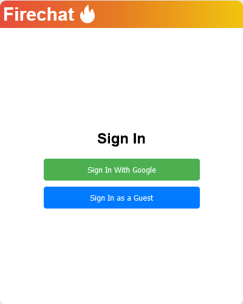

# Firechat: A chatroom application
Chatroom application

## Table of Contents

- [Features](#features)
- [Tech Stack](#tech-stack)
- [Installation](#installation)
- [Usage](#usage)
- [Screenshots](#screenshots)

## Features
- Chat with other users
- Simple interface
- Google Authentication

## Tech Stack
- **Backend**: Google Firebase & Firestore
- **Frontend**: React

## Installation
To install and run the Smolink server (Flask) locally, follow these steps:
1. Clone this repository:
    ```
    git clone https://github.com/mespino4/smolink.git
    ```

2. Install dependencies:
    ```
    npm install
    ```

3. Run the React development server:
    ```
    npm run dev
    ```

4. Access Firechat in your web browser, usually at `http://localhost:5173/`.

## Usage
1. Open Firechat in your web browser.
2. Sign in either with your Google account or as a guest
3. Enter a chatroom name you want join
4. Send a message

## Screenshots


*Login page*


*Enter Chatroom name*


*Send a message*

## Demo


*A demonstration of how Firechat works.*
